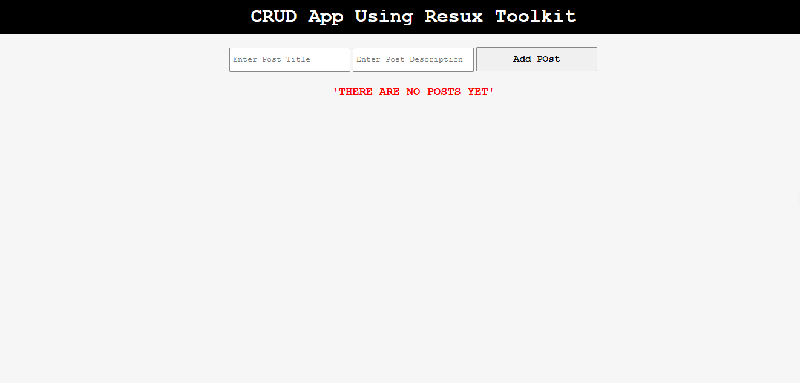

# CRUD_Redux-Toolkit-hamza

This is a simple Crud application built with ReactJs [function-component,"hooks"]+redux-toolkit. It allows users to add, edit, update and delete post.

## Table of contents

- [Overview](#overview)
- [Features](#Features)
- [Components](#Components)
  - [App](#App)
  - [Posts](#Posts)
- [Installation](#Installation)
- [Usage](#Usage)
- [Links](#Links)
- [Screenshot](#Screenshot)
- [What I learned](#what-i-learned)
- [Continued development](#continued-development)
- [Author](#author)
- [Acknowledgments](#Acknowledgments)


## overview
This is a simple Crud application built with ReactJs [function-component,"hooks"]+redux-toolkit. It allows users to add, edit, update and delete post.

## Features
- add, edit, update and delete post

## Components

### App

The main component that holds a Posts component.

### Posts

Contains tha whole logic.


## Installation
To get started with this project, follow these steps:

you can clone the project or download it as Zip file.
1. Clone the repository:
   ```bash
   git clone https://github.com/olahasan/CRUD_Redux-Toolkit-hamza.git

2. Navigate to the project directory:
   cd <project-directory>

3. Install the required dependencies:
   npm install   


## Usage
To run the application, use the following command:

npm start


## Links

If you want to open the link in a new tab, you can:

- Press **Ctrl** (or **Cmd** on Mac) while clicking the link.
- Right-click the link and select **Open link in new tab**.

Otherwise, all links will open in the same tab.


- Solution URL: [here](https://github.com/olahasan/CRUD_Redux-Toolkit-hamza)

- Live Site URL: [here](https://crud-redux-toolkit-hamza.surge.sh/) OR [here](https://crud-redux-toolkit-hamza.netlify.app/)

 ## Screenshot
 



## what-i-learned
Through this project:
- I learned how to create react app with function component.
- how to add,edit,update and delete.
- how to deploy it on Surge.sh and netlify

## Continued Development
In the future, I plan to:
- learn more about reactJs Hooks.

### Author

GitHub - @olahasan

### Acknowledgments

I would like to thank the **[unique coderz academy](https://www.youtube.com/@UniqueCoderzAcademy)** for providing this challenge and to the community for their support.

